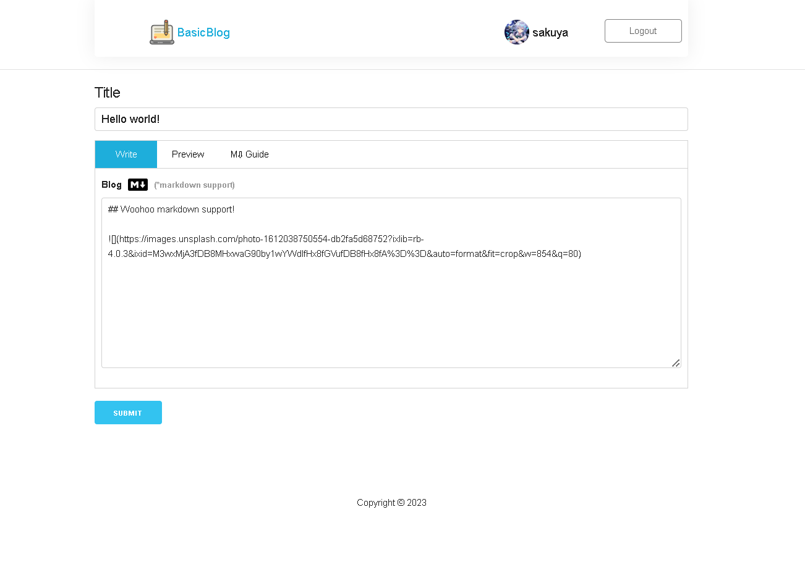
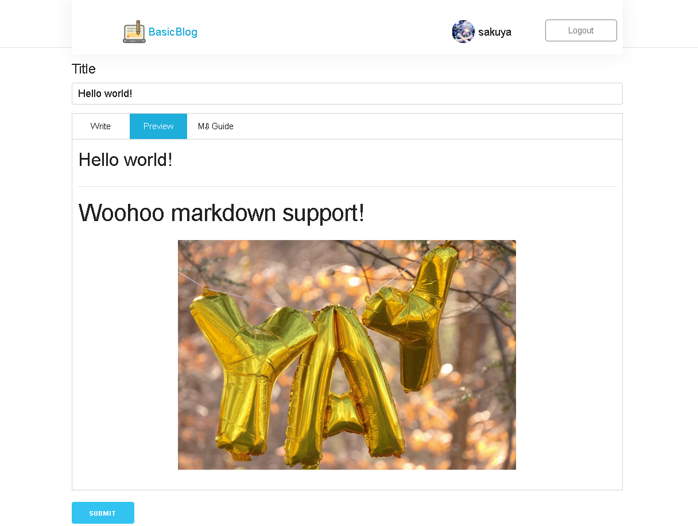
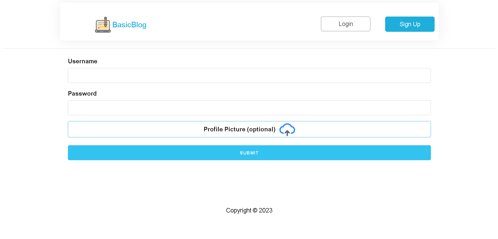

# Basic Blog

- [Backend overview](#backend-overview)
- [Frontend overview](#frontend-overview)
- [PostgreSQL DB structure](#postgresql-db-structure)
- [Blogs](#blogs)
- [Users](#users)
- [XSS]()
- [XSRF]()
- [Problems]()
- [Solutions]()
- [Unresolved]()
- [Next steps]()

## Backend overview

- ### Express

```js
const express = require("express");

const app = express();
```

This project's backend runs on express.js. Express provides a lot of good methods and features for building Node.js based servers. It has a great ecosystem, community support, and there is a lot of helpful middleware to use in your projects depending on your needs.

- ### REST API
  The backend I built for this project is basically a server that handles requests from the client by providing the frontend with a REST API.

```
// REST API example
http://localhost:3000/ -> GET request for homepage
http://localhost:3000/blog/1 -> GET request for blog with id=1
http://localhost:3000/create -> POST request to create blog
```

Basically, almost any operation (GET, POST, DELETE, PUT, etc...) gets a route.

- ### express.Router()

```js
const express = require("express");

const blogs_router = express.Router();
```

The above code is one example route that I have constructed. This route handles operations such as creating a blog (POST) or getting a single blog page (GET /blog/:id). I have made many such API routes with express router, which acts like a miny application for handling requests to a particular set of related routes. This feature of express is very good because it helps you split and organize your code into different parts, each of which is responsible for serving a particular purpose.

- ### middleware

```js
express.urlencoded({ extended: true })
express.json()
express.static(path.resolve(__dirname, "static")))
cookieParser()
```

These are the most important middleware functions that I used. Most of the above is standard boilerplate for an express app. `cookieParser` is the new one for me, I used it mainly for auth.

- ### devDependencies
  I used `nodemon` as a development dependency for its automatic server refresh/reload on change and `morgan` middleware to log well formatted requests and responses along with status code and response time. It is useful for debugging and for keeping an eye out for problems or issues.

## Frontend Overview

- ### EJS

  While the frontend is not fancy, it was great using a template engine for it. I have experience with React.js and Astro.js, using a framework/library is better for DX (developer experience) but I wanted to go back to basics with the frontend. Most of the content is server-side rendered, but the client-side logic and functionality (navbar and tabbed content for example) are in vanilla JavaScript. The templating engine I used is `ejs` which genuinely feels like `php`. On a more serious note though, the important concepts here are conditional rendering and using `include()` to include partials (later a similar concept of components appear in libraries/frameworks like react) which greatly help in modularizing your code and making it more debugging friendly. There are other important points, for examples you have to keep reminding yourself that you are still on the server while using `ejs`, that's basically what SSR is. Don't mix your frontend logic with the server side stuff!

- ### CSS

I used `skeleton.css` which provides a barebones (pun intended) styling of webpages. I used their grid system for the navbar but then I still had to heavily modify it with my own `css`. This is often the case if you just use helper files, you have to do a lot of the work which is very good for learning. I have learned a ton about `css` and its quirks while building the UI for this web app. It might look barebons but I like the minimalist design. It's a bit unrefined though, I can tell since I have experience using `css` frameworks such as `bulma` and `bootstrap`. But I had fun and learned a ton making my own custom css, it's been great!

- ### JS
  Just plain old `vanilla js`. A bunch of script tags and static files. I attempted to minify some of the UI related files.

The rest is standard stuff. Maybe the most impactful parts were about using the `fetch` API for communicating with the server and managing the server response on the client side.

## PostgreSQL DB structure

```SQL
CREATE TABLE IF NOT EXISTS users(
    id SERIAL PRIMARY KEY,
    user_name TEXT NOT NULL,
    pfp_mime TEXT,
    pfp BYTEA,
    registered_at TIMESTAMPTZ DEFAULT now(),
    about TEXT,
    password_hash TEXT NOT NULL
);
```

Everything is fairly simple here. The `id` is a primary key in this table and will be a foreign key in the `blogs` table. Perhaps it is noticeable that `pfp BYTEA` is the odd one out. This is a type for storing binary strings. It can be used to store large objects. I believe the limit for storage is around 1 or 2gb. I use it to store the user's profile picture, decoded from `base64`. I use the `sharp` npm module to resize user profile images to `200x200` images. These images should take up around 15kb on average but I have seen values as high as 58kb while testing.

The standard/best practice way to store files is using the file system. I have a good understanding of the file system using node.js `fs` module. However, since this site is deployed using serverless technologies `cyclic.sh, render`, I am unable to access the file system. One of the standard solutions for this is using cloud storage such as the famous `AWS S3` buckets to store files and constructing `url` strings to access these files. Configuring and testing that, however, took me a bit more time than I had anticipated and I thought it was quite unnecessary for me to pursue a deadend while I already understood the fundamentals of file manipulation and file storage (a few commits ago complete profiles part was running purely on `fs`). Additionally, I had to suffer through a few engineering exams (heat transfer, mass transfer) during this already hot summer. It is still a great turning point however, I will be on the lookout for improving on cloud storage in the future. At least I learned how to handle `BYTEA` type in `PostgreSQL` and how to render `base64` images.

## Blogs





This web app is currently CRU(~~D~~). Users can create, update/edit posts (I did not yet add a delete mechanism). The main focus was on letting the user use markdown to post blogs. This was easy as I used the npm package markdown-it:

```
npm install markdown-it
```

## Users



Users signup and can optionally upload a profile picture. This profile picture is later resized in the backend using `sharp`:

```
npm install sharp
```

It is submitted as a multi-part formData:

```js
// Frontend:
const formData = new FormData();

formData.append("userfile", fileInputElement.files[0]); // https://developer.mozilla.org/en-US/docs/Web/API/FormData/Using_FormData_Objects

formData.append("username", usernameInputElement.value);
formData.append("password", passwordInputElement.value);

//...

fetch("/signup", {
  method: "post",
  body: formData,
});

//...
```

In the backend I use `multer`:

```
npm install multer
```

in order to "parse" the formdata. It assigns the uploaded file to `req.file` (if you use `upload.single`), and the rest of the text fields are can be accessed from the `req.body` object. I convert the profile image to `base64` and save it to the `db` along with the user details in an `sql` transaction.
